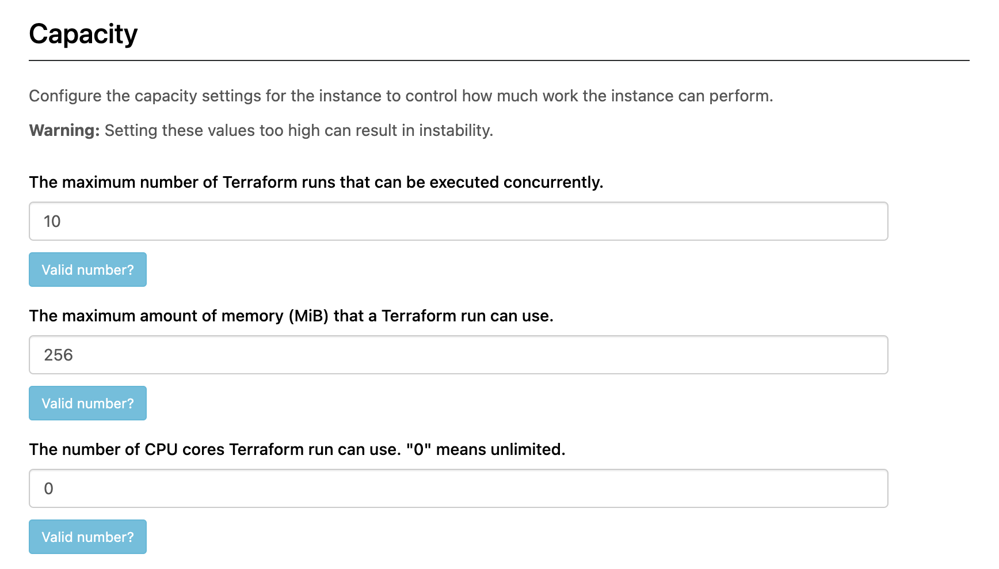
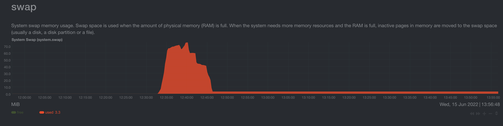
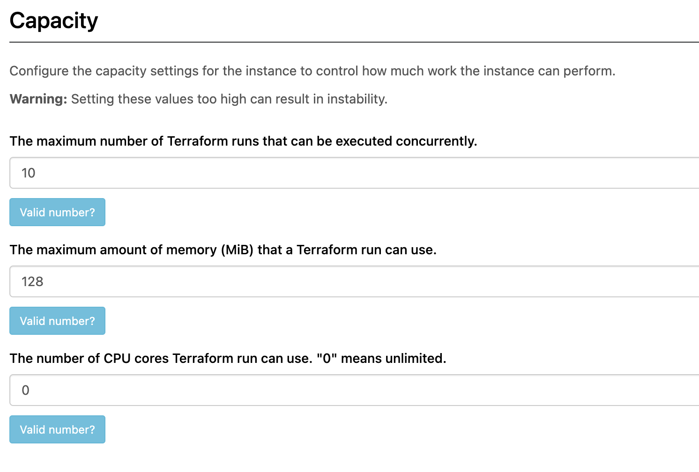
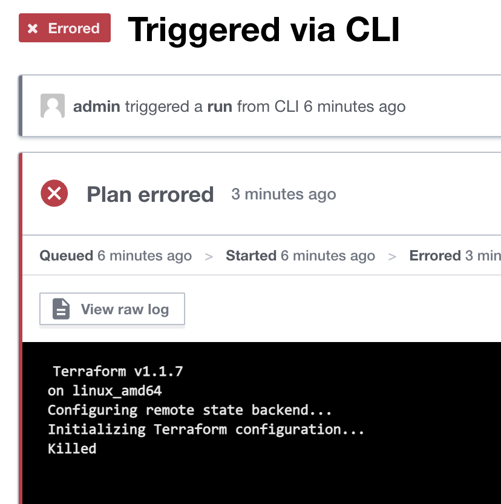
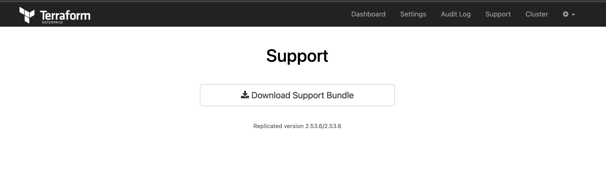

# TFE workload script

This repository provides some Terraform scripts to force a heavy load on a TFE environment by creating 9 workspaces and running a big terraform simultaneously on these workspaces. 

By utilizing so much load on your TFE environment you simulate multiple scenario's described here

# General Prerequisites

Make sure you have a TFE running. Use the following repository for example

[TFE airgap AWS](https://github.com/munnep/TFE_airgap)

# TFE swapping

Running this load on a TFE environment with some incorrect settings on your TFE environment you should see the system swapping in the memory performance metrics. 


## Prerequisites

- On your TFE environment make sure you change the swapping levels to 95
```
sysctl vm.swappiness=95
```
- On your TFE environment make sure that worker memory is 256MB
```
# see the current value
replicatedctl app-config export --template "{{.capacity_memory.Value}}"

# change it to 256
replicatedctl app-config set capacity_memory --value 256

# restart the application to apply the config changes
replicatedctl app apply-config
```
or change it in the dashboard  
  
## How to

- Clone the repository to a machine that you want the load to run
```
git clone https://github.com/munnep/tfe_workload.git
```
- Go to the directory tfe_workload/terraform_workspaces
```
cd tfe_workload/terraform_workspaces
```
- add a file called `variables.auto.tfvars` with the following content
```
organization = "test"
tfe_token    = "your_token"
tfe_hostname = "patrick-tfe6.bg.hashicorp-success.com"
``` 
- initialize terraform
```
terraform init
```
- apply the changes to create the workspaces
```
terraform apply
```
- login to your terraform cloud environment
```
terraform login <tfe-url>
```
- change the below settings to match your environment in the file base/main.tf
hostname
organization
```
terraform {
  backend "remote" {
    hostname     = "patrick-tfe6.bg.hashicorp-success.com"
    organization = "test"

    workspaces {
      prefix = "test-"
    }
  }
}
```
- execute the script that will make the directories and execute the terraform code
```
bash run.sh
```
- Within TFE you should see all workspaces have jobs running now
- In your performance charts of your TFE instance you should see that swap will be getting used now.
Example screenshot of Netdata that was installed on the TFE server 
    
- destroy the workspaces by going into the directory tfe_workload/terraform_workspaces
```
terraform destroy
```


# oom-kill

Running this load on a TFE environment with some incorrect settings on your TFE environment you should get an oom-kill on the terraform run.


## Prerequisites

- On your TFE environment turn swapping off
```
sudo swapoff -a
```
- On your TFE environment make sure that worker memory is 128MB
```
# see the current value
replicatedctl app-config export --template "{{.capacity_memory.Value}}"

# change it to 128
replicatedctl app-config set capacity_memory --value 128

# restart the application to apply the config changes
replicatedctl app apply-config
```
or change it in the dashboard  
    

## How to

- Clone the repository to a machine that you want the load to run
```
git clone https://github.com/munnep/tfe_workload.git
```
- Go to the directory tfe_workload/terraform_workspaces
```
cd tfe_workload/terraform_workspaces
```
- add a file called `variables.auto.tfvars` with the following content
```
organization = "test"
tfe_token    = "your_token"
tfe_hostname = "patrick-tfe6.bg.hashicorp-success.com"
``` 
- initialize terraform
```
terraform init
```
- apply the changes to create the workspaces
```
terraform apply
```
- login to your terraform cloud environment
```
terraform login <tfe-url>
```
- change the below settings to match your environment in the file base/main.tf
hostname
organization
```
terraform {
  backend "remote" {
    hostname     = "patrick-tfe6.bg.hashicorp-success.com"
    organization = "test"

    workspaces {
      prefix = "test-"
    }
  }
}
```
- execute the script that will make the directories and execute the terraform code
```
bash run.sh
```
- Within TFE you should see all workspaces have jobs running now
- you should see the tasks getting killed at some point like the following  
  
- Download a support bundle from your dashboard
    
- If you look in the bundle and search for oom-kill you will see you will get a find like the following
```
[17612.605083] br-c70e2168ae73: port 2(vethe99ed86) entered forwarding state
[17744.519687] terraform invoked oom-killer: gfp_mask=0x100cca(GFP_HIGHUSER_MOVABLE), order=0, oom_score_adj=0
[17744.519696] CPU: 2 PID: 323609 Comm: terraform Not tainted 5.13.0-1022-aws #24~20.04.1-Ubuntu
```
- destroy the workspaces by going into the directory tfe_workload/terraform_workspaces
```
terraform destroy
```

