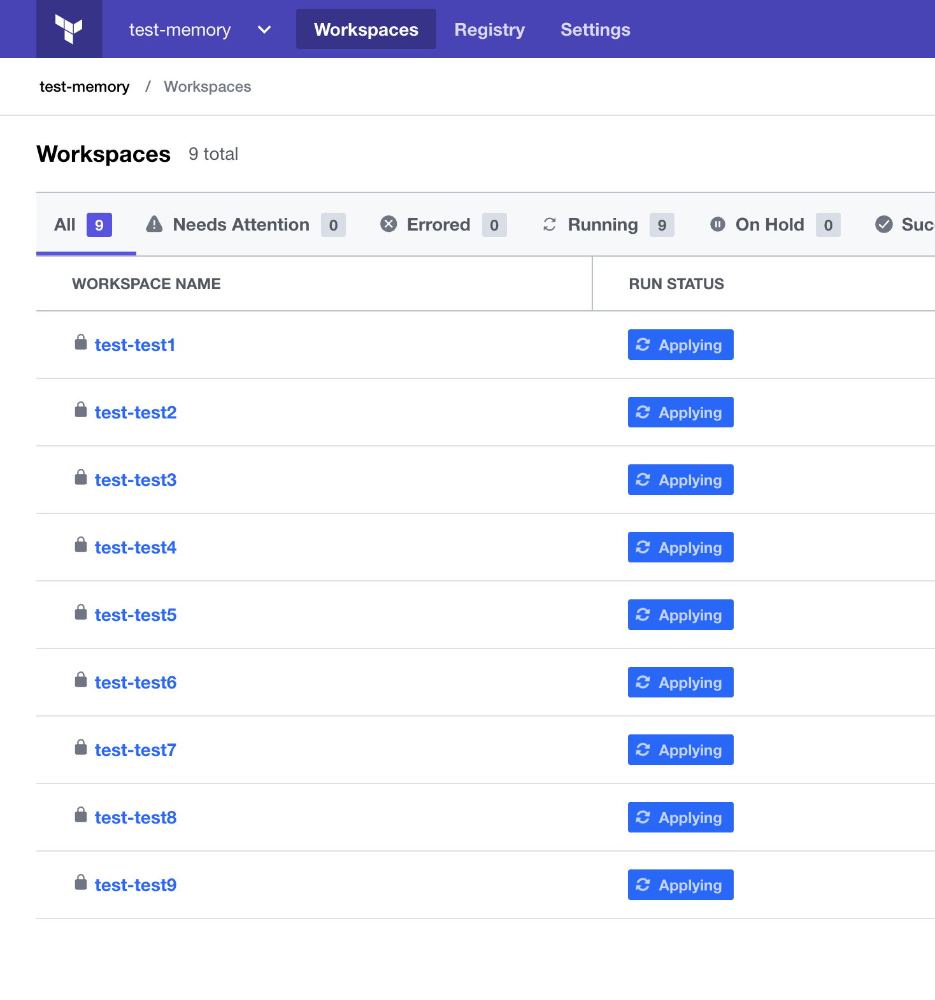

# TFE workload script

This repository provides some Terraform scripts to force a heavy load on a TFE environment by creating 9 workspaces and running a big terraform simultaneously on these workspaces. 

By utilizing so much load on your TFE environment you simulate multiple scenario's described here

# Prerequisites

Make sure you have a TFE running. Use the following repository for example

[TFE airgap AWS](https://github.com/munnep/TFE_airgap)

# TFE swapping

Running this load on a TFE environment with some incorrect settings on your TFE environment you should see the system swapping in the memory performance metrics. 

## How to

- Clone the repository to a machine that you want the load to run
```
git clone https://github.com/munnep/TFE_upgrade_tests.git
```
- Go to the directory
```
cd TFE_upgrade_tests
```


Replicated:    
  

Workspace:  
environment variable 
```
TFE_PARALLELISM 200
```

Linux:  
```
root@ip-10-234-1-22:~# sysctl vm.swappiness
vm.swappiness = 85
```
Runs:
have 9 runs going  
  

# run the job
- Alter the tfe_workload/base/main.tf with your organisation information
- start the run.sh 
```
bash run.sh
```


# output
We see heavy swapping  
also top is showing a different wait even    
```
top - 19:25:28 up 12:59,  1 user,  load average: 51.85, 40.49, 38.27
Tasks: 366 total,   2 running, 364 sleeping,   0 stopped,   0 zombie
%Cpu0  : 16.1 us, 29.3 sy,  0.1 ni,  0.4 id, 53.8 wa,  0.0 hi,  0.1 si,  0.2 st
%Cpu1  : 21.3 us, 12.9 sy,  0.3 ni,  0.2 id, 65.2 wa,  0.0 hi,  0.1 si,  0.1 st
%Cpu2  : 18.1 us, 24.4 sy,  0.1 ni,  6.8 id, 49.4 wa,  0.0 hi,  0.0 si,  1.1 st
%Cpu3  : 27.7 us,  7.9 sy,  0.2 ni,  4.4 id, 58.6 wa,  0.0 hi,  0.0 si,  1.2 st
MiB Mem :  15817.4 total,   6123.3 free,   5834.5 used,   3859.7 buff/cache
MiB Swap:  32768.0 total,  31362.0 free,   1406.0 used.  10047.3 avail Mem 
```  
      

iostat  
```
avg-cpu:  %user   %nice %system %iowait  %steal   %idle
           7.41    0.36   19.78   47.11    0.20   25.14

Device            r/s     rMB/s   rrqm/s  %rrqm r_await rareq-sz     w/s     wMB/s   wrqm/s  %wrqm w_await wareq-sz     d/s     dMB/s   drqm/s  %drqm d_await dareq-sz  aqu-sz  %util
loop0            0.00      0.00     0.00   0.00    0.00     0.00    0.00      0.00     0.00   0.00    0.00     0.00    0.00      0.00     0.00   0.00    0.00     0.00    0.00   0.00
loop1            0.00      0.00     0.00   0.00    0.00     0.00    0.00      0.00     0.00   0.00    0.00     0.00    0.00      0.00     0.00   0.00    0.00     0.00    0.00   0.00
loop2            0.00      0.00     0.00   0.00    0.00     0.00    0.00      0.00     0.00   0.00    0.00     0.00    0.00      0.00     0.00   0.00    0.00     0.00    0.00   0.00
loop3            0.00      0.00     0.00   0.00    0.00     0.00    0.00      0.00     0.00   0.00    0.00     0.00    0.00      0.00     0.00   0.00    0.00     0.00    0.00   0.00
loop4            0.00      0.00     0.00   0.00    0.00     0.00    0.00      0.00     0.00   0.00    0.00     0.00    0.00      0.00     0.00   0.00    0.00     0.00    0.00   0.00
loop5            0.00      0.00     0.00   0.00    0.00     0.00    0.00      0.00     0.00   0.00    0.00     0.00    0.00      0.00     0.00   0.00    0.00     0.00    0.00   0.00
loop6            0.00      0.00     0.00   0.00    0.00     0.00    0.00      0.00     0.00   0.00    0.00     0.00    0.00      0.00     0.00   0.00    0.00     0.00    0.00   0.00
loop7            0.00      0.00     0.00   0.00    0.00     0.00    0.00      0.00     0.00   0.00    0.00     0.00    0.00      0.00     0.00   0.00    0.00     0.00    0.00   0.00
loop8            0.00      0.00     0.00   0.00    0.00     0.00    0.00      0.00     0.00   0.00    0.00     0.00    0.00      0.00     0.00   0.00    0.00     0.00    0.00   0.00
nvme0n1          0.00      0.00     0.00   0.00    0.00     0.00    0.00      0.00     0.00   0.00    0.00     0.00    0.00      0.00     0.00   0.00    0.00     0.00    0.00   0.00
nvme1n1       1682.20      6.59     5.00   0.30    4.51     4.01 1318.80      5.35    51.20   3.74    4.12     4.16    0.00      0.00     0.00   0.00    0.00     0.00   13.03  99.92              <-- swap disk
nvme2n1         37.40      1.34     0.00   0.00    0.59    36.56    7.80      0.32     2.40  23.53    1.21    42.35    0.00      0.00     0.00   0.00    0.00     0.00    0.03   5.28
```

netdata created an export file `netdata-ip-10-234-1-22-20220525-190901-7200.snap`  
export as a pdf file `netdata-swapping.pdf`  

    
      
    
  
